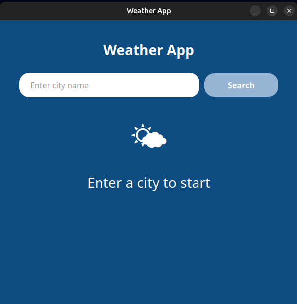
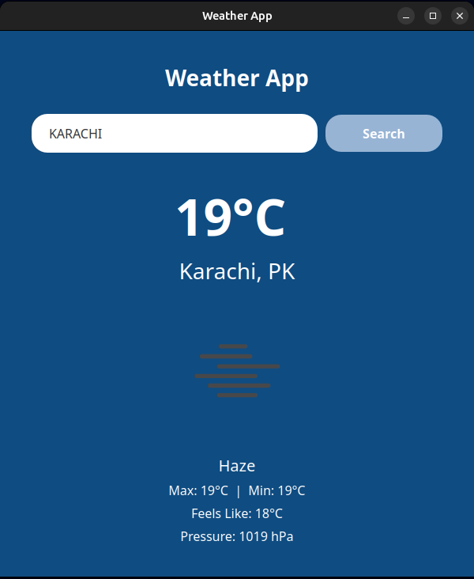

# 🌤️ Weather App

A beautiful and modern desktop weather application built with Python and PyQt5 that provides real-time weather information for any city in the world.


## ✨ Features

- 🔍 **Real-time Weather Data**: Search for any city worldwide and get instant weather updates
- 🌡️ **Comprehensive Information**: 
  - Current temperature (°C)
  - Feels-like temperature
  - Min/Max temperature
  - Weather description
  - Atmospheric pressure
  - Weather icons
- 🎨 **Beautiful UI**: Modern gradient blue interface with smooth animations
- 🖼️ **Custom Icons**: Support for custom app icons (SVG/PNG)
- ⚡ **Fast & Responsive**: Quick API responses with built-in timeout handling
- 🛡️ **Error Handling**: Comprehensive error messages for various scenarios

## 📸 Screenshots

<table align="center">
  <tr>
    <td></td>
    <td></td>
  </tr>
  <tr>
    <td align="center"><em>App on startup - Ready to search</em></td>
    <td align="center"><em>Displaying live weather data</em></td>
  </tr>
</table>

## 🚀 Getting Started

### Prerequisites

Before you begin, ensure you have the following installed:
- Python 3.8 or higher
- pip (Python package installer)

### Installation

1. **Clone the repository** (or download the ZIP file)
   ```bash
   git clone https://github.com/yourusername/weather-app.git
   cd weather-app
   ```

2. **Install required packages**
   ```bash
   pip install PyQt5 requests python-dotenv
   ```

3. **Get your API key**
   - Visit [OpenWeatherMap](https://openweathermap.org/api)
   - Sign up for a free account
   - Generate an API key from your account dashboard

4. **Create a `.env` file** in the project directory
   ```bash
   touch .env
   ```

5. **Add your API key** to the `.env` file
   ```
   WEATHER_API_KEY=your_api_key_here
   ```

6. **(Optional) Add a custom icon**
   - Place your icon file (PNG, SVG, JPG, or ICO) in the project directory
   - Name it `weather.svg` (or update the filename in the code)

### Running the App

Simply run:
```bash
python weather_app.py
```

Or on some systems:
```bash
python3 weather_app.py
```

## 🎯 Usage

1. **Launch the application**
2. **Enter a city name** in the search box (e.g., "London", "New York", "Tokyo")
3. **Click the "Search" button** or press Enter
4. **View the weather information** displayed on screen

### Supported Cities

The app supports any city recognized by OpenWeatherMap, including:
- Major cities (London, Paris, Tokyo, New York)
- Small towns and villages
- Cities with multiple-word names (New York, Los Angeles)

## 🛠️ Project Structure

```
weather-app/
│
├── weather_app.py       # Main application file
├── .env                 # Environment variables (API key)
├── weather.svg          # App icon (optional)
├── README.md            # This file
└── requirements.txt     # Python dependencies
```

## 📦 Dependencies

```
PyQt5>=5.15.0
requests>=2.28.0
python-dotenv>=0.19.0
```

Install all dependencies at once:
```bash
pip install -r requirements.txt
```

## 🎨 Customization

### Change Temperature Units

By default, the app displays temperature in Celsius. To add Fahrenheit support, you can modify the `display_weather` method (conversion is already calculated but not displayed).

### Customize Colors

Edit the stylesheet in the `initUI()` method:
```python
self.setStyleSheet("""
    QWidget {
        background-color: #0F4C81;  /* Change background color */
    }
    QPushButton {
        background-color: #98B4D4;  /* Change button color */
    }
    /* ... more styles ... */
""")
```

### Add More Weather Data

The OpenWeatherMap API provides additional data like:
- Humidity
- Wind speed and direction
- Sunrise/sunset times
- UV index

Check the [OpenWeatherMap API documentation](https://openweathermap.org/current) to add more features.

## 🐛 Troubleshooting

### "Unauthorized – invalid API key"
- Double-check your API key in the `.env` file
- Ensure there are no extra spaces or quotes around the key
- Wait a few minutes after generating a new API key (it may take time to activate)

### "City not found"
- Check the spelling of the city name
- Try adding the country code (e.g., "London,UK")
- Some small cities may not be in the database

### Icon not showing
- Ensure the icon file is in the same directory as `weather_app.py`
- Check that the filename matches exactly (case-sensitive)
- Supported formats: PNG, SVG, JPG, ICO

### No internet connection error
- Check your internet connection
- Verify that your firewall isn't blocking the app
- Try again after a few moments

## 📝 API Rate Limits

The free OpenWeatherMap API tier includes:
- 60 calls per minute
- 1,000,000 calls per month

For most personal use, this is more than sufficient.

## 🤝 Contributing

Contributions are welcome! Here's how you can help:

1. Fork the repository
2. Create a new branch (`git checkout -b feature/AmazingFeature`)
3. Commit your changes (`git commit -m 'Add some AmazingFeature'`)
4. Push to the branch (`git push origin feature/AmazingFeature`)
5. Open a Pull Request

## 📜 License

This project is licensed under the MIT License - see the [LICENSE](LICENSE) file for details.

## 🙏 Acknowledgments

- Weather data provided by [OpenWeatherMap](https://openweathermap.org/)
- Built with [PyQt5](https://www.riverbankcomputing.com/software/pyqt/)
- Icons from OpenWeatherMap's icon set

## 📧 Contact

SAMIULLAH - [SamiKhan43](https://github.com/SamiKhan43) - [EMAIL](qwertynoob456@gmail.com)

Project Link: [https://github.com/yourusername/weather-app](https://github.com/yourusername/weather-app)

## 🔮 Future Enhancements

- [ ] 5-day weather forecast
- [ ] Multiple city comparison
- [ ] Weather alerts and notifications
- [ ] Save favorite cities
- [ ] Dark/Light theme toggle
- [ ] Hourly weather breakdown
- [ ] Weather maps integration
- [ ] Multi-language support

---

⭐ If you found this project helpful, please give it a star!
